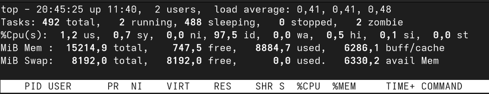

# LOG430 - Labo 00

Bastien Mallet

1. En exécutant la commande pytest, les tests qui ont échoués sont affichés dans le terminal comme ci-dessous : 

```
===================================================================== FAILURES =====================================================================
________________________________________________________________ test_addition_fail ________________________________________________________________

    def test_addition_fail():
        my_calculator = Calculator()
>       assert my_calculator.addition(5, 3) == 38
E       assert 8 == 38
E        +  where 8 = addition(5, 3)
E        +    where addition = <calculator.Calculator object at 0x7f5a08673390>.addition

src/tests/test_calculator.py:21: AssertionError
============================================================= short test summary info ==============================================================
FAILED src/tests/test_calculator.py::test_addition_fail - assert 8 == 38
```

La ligne où le test échoue est indiquée avec l'erreur pour laquelle le test a échoué.

Ici, le test `addition_fail()` échoue volontairement car la fonction `addition(5,3)` renvoie 8 alors que le résultat 
attendu, qui est volontairement erroné, est de 38.

2.

Le workflow défini dans `.github/workflows/cicd.yml` est exécuté à chaque push et à chaque pull request.

Voici les différentes étapes du workflow dans GitHub Actions de CI : 

- Étape de setup job : 

Lors de cette étape, un runner éphémère est créé avec Ubuntu comme système d'exploitation. C'est dans ce runner
que la suite de notre workflow va être éxécutée.

```
Current runner version: '2.328.0'
Runner Image Provisioner
  Hosted Compute Agent
  Version: 20250829.383
  Commit: 27cb235aab5b0e52e153a26cd86b4742e89dac5d
  Build Date: 2025-08-29T13:48:48Z
Operating System
  Ubuntu
  24.04.3
  LTS
Runner Image
  Image: ubuntu-24.04
  Version: 20250907.24.1
  Included Software: https://github.com/actions/runner-images/blob/ubuntu24/20250907.24/images/ubuntu/Ubuntu2404-Readme.md
  Image Release: https://github.com/actions/runner-images/releases/tag/ubuntu24%2F20250907.24
GITHUB_TOKEN Permissions
  Actions: write
  Attestations: write
  Checks: write
  Contents: write
  Deployments: write
  Discussions: write
  Issues: write
  Metadata: read
  Models: read
  Packages: write
  Pages: write
  PullRequests: write
  RepositoryProjects: write
  SecurityEvents: write
  Statuses: write
Secret source: Actions
Prepare workflow directory
Prepare all required actions
Getting action download info
Download action repository 'actions/checkout@v3' (SHA:f43a0e5ff2bd294095638e18286ca9a3d1956744)
Download action repository 'actions/setup-python@v4' (SHA:7f4fc3e22c37d6ff65e88745f38bd3157c663f7c)
Complete job name: build
```

- Checkout dépôt

Lors de cette étape, l'ensemble du contenu du repository sur github est copié à l'intérieur du runner.

```
Run actions/checkout@v3
Syncing repository: bastienm38/log430-a25-labo0
Getting Git version info
Temporarily overriding HOME='/home/runner/work/_temp/d1499f5b-1a7e-4cc5-96da-8e53e82cdf14' before making global git config changes
Adding repository directory to the temporary git global config as a safe directory
/usr/bin/git config --global --add safe.directory /home/runner/work/log430-a25-labo0/log430-a25-labo0
Deleting the contents of '/home/runner/work/log430-a25-labo0/log430-a25-labo0'
Initializing the repository
Disabling automatic garbage collection
Setting up auth
Fetching the repository
Determining the checkout info
Checking out the ref
/usr/bin/git log -1 --format='%H'
'e9e6b4eb685eec33e64e71cd70cc13343861acb0'
```

- Installer python

Lors de cette étape, Python est installé sur le runner dans la version 3.11

```
Run actions/setup-python@v4
Installed versions
  Successfully set up CPython (3.11.13)
```

- Installer les dépendances

Les dépendances nécéssaires, et notamment pytest sont installées sur le runner à l'aide du gestionnaire de paquet pip.

```
Run python -m pip install --upgrade pip
Requirement already satisfied: pip in /opt/hostedtoolcache/Python/3.11.13/x64/lib/python3.11/site-packages (25.2)
Collecting pytest (from -r requirements.txt (line 1))
  Downloading pytest-8.4.2-py3-none-any.whl.metadata (7.7 kB)
Collecting iniconfig>=1 (from pytest->-r requirements.txt (line 1))
  Downloading iniconfig-2.1.0-py3-none-any.whl.metadata (2.7 kB)
Collecting packaging>=20 (from pytest->-r requirements.txt (line 1))
  Downloading packaging-25.0-py3-none-any.whl.metadata (3.3 kB)
Collecting pluggy<2,>=1.5 (from pytest->-r requirements.txt (line 1))
  Downloading pluggy-1.6.0-py3-none-any.whl.metadata (4.8 kB)
Collecting pygments>=2.7.2 (from pytest->-r requirements.txt (line 1))
  Downloading pygments-2.19.2-py3-none-any.whl.metadata (2.5 kB)
Downloading pytest-8.4.2-py3-none-any.whl (365 kB)
Downloading pluggy-1.6.0-py3-none-any.whl (20 kB)
Downloading iniconfig-2.1.0-py3-none-any.whl (6.0 kB)
Downloading packaging-25.0-py3-none-any.whl (66 kB)
Downloading pygments-2.19.2-py3-none-any.whl (1.2 MB)
   ━━━━━━━━━━━━━━━━━━━━━━━━━━━━━━━━━━━━━━━━ 1.2/1.2 MB 12.6 MB/s  0:00:00
Installing collected packages: pygments, pluggy, packaging, iniconfig, pytest

Successfully installed iniconfig-2.1.0 packaging-25.0 pluggy-1.6.0 pygments-2.19.2 pytest-8.4.2
Requirement already satisfied: pytest in /opt/hostedtoolcache/Python/3.11.13/x64/lib/python3.11/site-packages (8.4.2)
Requirement already satisfied: iniconfig>=1 in /opt/hostedtoolcache/Python/3.11.13/x64/lib/python3.11/site-packages (from pytest) (2.1.0)
Requirement already satisfied: packaging>=20 in /opt/hostedtoolcache/Python/3.11.13/x64/lib/python3.11/site-packages (from pytest) (25.0)
Requirement already satisfied: pluggy<2,>=1.5 in /opt/hostedtoolcache/Python/3.11.13/x64/lib/python3.11/site-packages (from pytest) (1.6.0)
Requirement already satisfied: pygments>=2.7.2 in /opt/hostedtoolcache/Python/3.11.13/x64/lib/python3.11/site-packages (from pytest) (2.19.2)
```


- Tests

À cette étape, les tests sont lancés à l'aide de pytest.

```
Run python -m pytest 
============================= test session starts ==============================
platform linux -- Python 3.11.13, pytest-8.4.2, pluggy-1.6.0
rootdir: /home/runner/work/log430-a25-labo0/log430-a25-labo0/src
collected 2 items

tests/test_calculator.py ..                                              [100%]

============================== 2 passed in 0.01s ===============================
```

3.

Pour automatiser le déploiement vers la machine virtuelle, il faut préalablement installer Docker sur la VM afin que cette 
dernière puisse run un container Docker qui lance le script Python de la calculatrice.

Pour automatiser le déploiement, j'ai utilisé un runner Github self-hosted sur la VM.

Le workflow de CD est ainsi exécuté directement sur la VM.

Le job deploy va ainsi : 
- copier le contenu du repository github sur la VM
- Arrêter les containers docker en cours d'exécution
- Build les images Docker
- Démarrer les containers avec Docker Compose

```yml
  deploy:
    runs-on: self-hosted
    needs: test   # Démarre seulement si les tests passent
    steps:
      - name: Checkout repo
        uses: actions/checkout@v4

      - name: Deploiement avec Docker Compose
        run: |
          cd $GITHUB_WORKSPACE
          docker compose down || true
          docker compose build --no-cache
          docker compose up -d
```

4.



La commande `top` permet d'afficher différentes informations : 
- Le nombre de processus en cours
- Le taux d'utilisation du CPU
- Le taux d'utilisation de la RAM
- La liste des processus en cours, et pour chacun d'entre eux leur PID, leur utilisateur, leur utilisation de CPU et de RAM, le nom du programme...